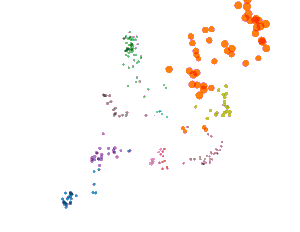
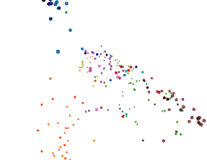

# Pretrained Biomedical Name Encoder
This repository contains the pre-trained biomedical name encoders proposed in the paper "Robust Representation Learning of Biomedical Names", ACL 2019.

# Dependencies
The encoder is tested with the following dependency settings:
  * Python 3.6.5
  * tensorflow==1.12.0
  * tensorflow-gpu==1.12.0 (required if use GPU)
  * numpy==1.16.1
  * spacy==2.0.12 and the ['en_core_web_sm'](https://spacy.io/usage/models) model
  * tqdm==4.31.1

# Two pretrained encoders
We release **BNE_SGw** and **BNE_SGsc** pretrained encoders described in our paper. These encoders are based on **BiLSTM**. They take word embeddings as input and calculate a vector representation for each name (multi-word expression).
  * The input word embeddings used by BNE_SGw are trained by a skip-gram model.
  * The input word embeddings used by BNE_SGsc are trained jointly with name phrase and concept embeddings, by another skip-gram model.

# Usage
1. Download and extract two input word embedding files, Emb_SGw.txt (3.7GB) and Emb_SGsc.txt (8.8GB), from [BioEmd.zip](https://bit.ly/2LnM5E7) (5.0GB). These embeddings are pretrained on PubMed abstracts.
2. Create an input file names.txt to store the input names, one name on each line.
3. Run either of these commands. You may need to update the file paths accordingly.
```
python bne.py --model models/BNE_SGw --fe e:/Emb_SGw.txt --fi names.txt --fo output_BNE_SGw.txt
python bne.py --model models/BNE_SGsc --fe e:/Emb_SGsc.txt --fi names.txt --fo output_BNE_SGsc.txt
```
4.  The output is a text file. Each line starts with a name, followed by a tab character and the name's embedding values.

# Embedding visualization
Let's use the embedding projector (https://projector.tensorflow.org/) to visualize the name embeddings. 
To export files for this projector, declare additional file (--fl labels.txt), which contains labels for the input names, when calculating the embeddings.
```
python bne.py --model models/BNE_SGw --fe e:/Emb_SGw.txt --fi names.txt --fl labels.txt --fo output_BNE_SGw.txt
python bne.py --model AvgEmb --fe e:/Emb_SGsc.txt --fi names.txt --fl labels.txt --fo output_AvgEmb_SGw.txt
```
The projector files will be exported in folder 'projector'. Open https://projector.tensorflow.org/ and load these files.

Here is the PCA visualization of 254 name embeddings. These embeddings belong to 10 disease concepts which are shown in different colors.

BNE_SGw pretrained model             |  Baseline (Average word embedding)
:-------------------------:|:-------------------------:
  |  
[view on the projector](https://projector.tensorflow.org/?config=https://raw.githubusercontent.com/minhcp/BNE/master/temp/projector_config_BNE_SGw.json) | [view on the projector](https://projector.tensorflow.org/?config=https://raw.githubusercontent.com/minhcp/BNE/master/temp/projector_config_AvgEmb_SGw.json)

# Pre-calculated UMLS name embeddings
We calculate embeddings of 2.2 million biomedical names in UMLS. These names are specified by the 'STR' column in MRCONSO.RRF file, UMLS 2018AA-full dump. We consider only the names in 4 popular biomedical vocabularies OMIM, SNOMEDCT_US, MSH, and ICD10.

Download and extract these pre-calculated embedding file UMLS_output_BNE_SGw.txt (3.7GB) from [UMLS_output_BNE_SGw.zip](https://bit.ly/2Gg0Qo9) (1.2GB)

# Citation
We suggest the authors to cite this paper if you use the resources provided on this page.
```
@inproceedings{minh2019bne,
  author    = {Minh C. Phan and Aixin Sun and Yi Tay},
  title     = {Robust Representation Learning of Biomedical Names},
  booktitle = {ACL},
  year      = {2019},
}
```

